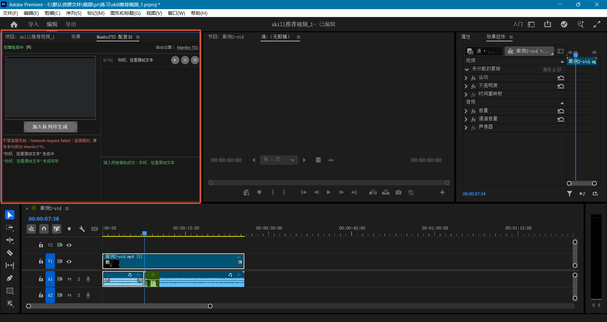

# MamboTTS 配音台 for Premiere Pro

这是一个 Adobe Premiere Pro UXP 面板，直接调用本机
[Tsukimisaka/MamboTTS](https://github.com/Tsukimisaka/MamboTTS) 提供的
GPT-SoVITS HTTP 接口 `http://127.0.0.1:9880/` 生成 AI 配音。

支持 Premiere Pro 25.6 及以上版本。

## 前提

首次使用前，请在项目根目录运行 `MamboTTS.bat`，完成所需依赖、运行环境和模型的安装，并确认 MamboTTS 能够正常生成语音。
初始化完成后，日常使用只需运行 `run_local_engine.bat` 启动本地推理引擎。

## 安装

要求 Premiere Pro 25.6 或更高版本。完全退出 Premiere，在 PowerShell 中运行：

    powershell -ExecutionPolicy Bypass -File .\install.ps1

重新打开 Premiere，在“窗口 -> UXP 增效工具 -> MamboTTS 配音台”打开面板。
开发调试也可以用 Adobe UXP Developer Tool 加载本目录的 manifest.json。

安装脚本执行成功后必须完全退出并重新打开 Premiere，运行中的 Premiere 不会刷新本地
UXP 插件列表。若使用 UXP Developer Tool 调试，还需要先在 Premiere 的
“设置 -> 增效工具”中启用开发人员模式并重启 Premiere。

## 功能

1. 自动检测本机 MamboTTS HTTP 引擎状态，也可以点击 `[R]` 手动刷新。
2. 支持一次输入多段文本：有空行时按空行分段，否则按换行分段，并依次加入生成队列；生成过程中仍可继续追加内容。
3. 自动保存生成的 WAV 文件。点击面板右上角的输出位置，可以选择并记住自定义文件夹；未设置时使用插件默认数据目录。
4. 配音管理列表显示每段文本和音频时长，并提供试听、插入、删除三个操作。
5. Windows 平台通过随插件安装的 `MamboTTSPreview.exe` 在后台试听，不需要切换到 Premiere 源监视器。
6. 插入时先在时间轴选择一个音频剪辑以指定目标音轨，再点击 `+`；音频会覆盖插入到该音轨的当前播放头位置。
7. 音频素材统一归档到 Premiere 项目根目录的 `Mambo TTS` 素材箱，不污染原工程素材箱，且不改变源监视器内容。
8. 删除配音时会同时移除列表记录、生成的 WAV 文件，以及已经导入 Premiere 的对应项目素材。
9. 面板分别记录生成和插入操作结果，便于查看引擎连接、生成、试听、插入或删除失败的具体原因。

> 注意：插件内后台试听目前仅支持 Windows。其他平台需要自行编译 `preview-player` 中适用于当前平台的二进制文件，并相应调整插件调用的文件名和启动权限。

## 卸载

完全退出 Premiere，在 PowerShell 中运行：

    powershell -ExecutionPolicy Bypass -File .\uninstall.ps1
